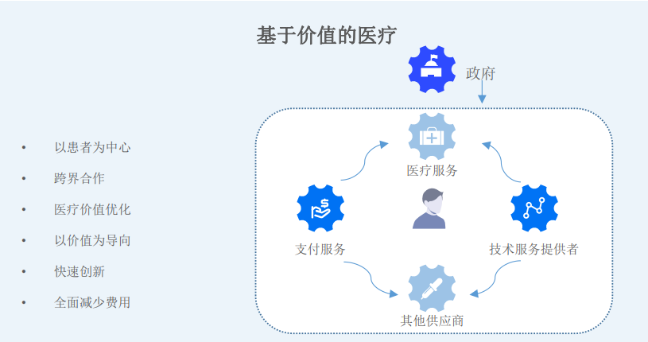

一个基于区块链技术打造的分布式人类健康数据的世界性项目，通过区块链去中心化
存储技术和智能合约，建立人类健康数据的革命性管理的新世界。

## 赋予每个人的健康数据于世界上独一无二的 NFT

NFT 是指非同质化代币，具有不可分割、不可替代、独一无二等特点。我们人类每个个
人的基因都是独一无二的，人体约有 100 万亿个细胞，每个细胞里的 DNA 含有 30 亿碱基
对的序列，其中所含有的基因共约有 7-10 万个，具有功能的基因约有 3.5 万个，它与人
类疾病健康密切相关，决定着人类的生、老、病、死以及长相、高矮、肤色、性格和
天赋特长等。简单地来总结，NFT 就像一个基因身份证，是世界上独一无二的，他仅仅
只属于你个人。我们在 Sinso 体系中为默认每个人创建一个独一无二的 NFT，可以作为
生物识别的身份证使用，并且我们还允许，把我们指定的数据部分，比如一个医学影
像的照片，一段指纹，一个骨骼的 3D 模型发行成 NFT。例如手术建模的数据也是和知识
创作紧密相关，和 NFT 有天然的联系。在创作中加入医生的所有权，未来通过数据交易
让相关数据生产者获得永久的收益。

Filecoin/IPFS 创始人胡安推特说：“不在 IPFS 上存储的 NFT，不是真正属于你的 NFT”, 这也是为什么基于 IPFS，让 NFT 将会真正属于个人。所以基于 IPFS 发行我们个人的 NFT，
具有非常实用的意义，比如只要和汽车厂商合作，那么我们的“生物识别的身份证”
其实是我们自己拥有并且具有使用价值，比如指静脉方式的开锁。

谁都不希望有人窥探和拿走我们的“心纹”，心纹和指纹加密的私钥将会是独一无二
的，并且终生携带，我们不会为忘记私钥而苦恼。我们可以灵活运用 NFT 和股权绑定，
建立股权和人身份唯一对应的关系，或者用自己的一部分身体数据资产入股到一个健
康管理和保险公司。个人信息和 AI 公司的割裂，导致交易成本和沟通成本很高，推高
了 AI 的价格，让医疗 AI 落地进度缓慢。我们其实完全可以变成 AI 公司的数据股东，
NFT 是非常理想的交易媒介，并不是所有的医疗数据都适合绑定发行 NFT，只有格式化
的可利用价值更高的数据适合 NFT，因为 NFT 的大部分目的是对高价值资产的确权和流
通。Sinso 创新地用极低的 GAS 费用就可以让人们创建属于自己的生物资产 NFT，这个
在医疗领域是非常有开创性的。个人一直以来都缺乏对医疗数据资产的激励，NFT 的
出现肯定会重新点燃这个市场。NFT 在医生 IP 品牌打造和医生粉丝经济方面具有举足
轻重的作用。医生正在走向自由执业时代，医生和艺术家一样是创作者经济，每个典
型的治疗过程、算法、模型都是非常有价值的作品。医生和粉丝之间可以构建基于
NFT 的粉丝经济，患者可以分享 IP 壮大后的收益，包括数据的整理完全可以变成一个
社区行为，从公司化变成了 DAO 架构，NFT 会深刻改变医患关系。

## 保障健康数据的安全性、隐秘性、自主性

数据所有权和数据运营权分离是困扰我们的长久的问题，很多公司在刻意回避这样的
问题，在医疗产业中，各个数据运营商为了获得数据都禁锢保守和自私自利。目前医
疗数据运营方面和隐私保护方面做的非常糟糕，威瑞森电信公司（Verizon）发布的
《2017 年的数据泄露调查报告》显示在数据泄露上，医疗保健行业是仅次于金融行业
的行业，占 15%；

在数据泄露原因方面，62% 的数据泄露与黑客攻击有关；全球电子医疗保健记录系统
中的数据在以每年 5.5% 的速度增长，医疗数据包含着病人的众多敏感数据，使得医
疗行业成为黑客攻击的重灾区。2020 年全球医疗数据泄露平均成本高达 713 万美元，这
比 2019 年增长了 10%以上。从 2019 年 7 月中旬到 2019 年 9 月初，Greenbone Networks 分析
了全球大约 2300 个在线 PACS 服务系统 Greenbone 的报告写道，“这些患者数据中有超
过 7.37 亿个医学放射图像，其中大约有 4 亿个放射图像可以访问，或者能从互联网
上轻松下载。”，我们可以认为相当一部分数据没有任何访问限制和隐私保护措施。
研究人员估计，暗网上泄露数据的价值可能超过 10 亿美元。

美国卫生与人类服务部（HHS）4 月份发布的一份报告估计，暗网上医疗健康记录数据
的平均价值为 250 美元，最多也有可能接近 1000 美元。再三强调，医疗数据是高价
值的数据，非常符合 Filecoin 的定位，这些对人类文明有推动作用的数据，应该需要
高度重视和持久的存储。医院就诊信息的泄露，不仅会造成患者的安全威胁、面临患
者的法律诉讼、医疗机构的声誉受损，严重的话还会导致社会安全感下降。线上的数
据并没有绝对的安全，如果期望绝对安全，很多医疗数据可能会采取离线归档的方式。
如果我们需要在线利用，并且还需要做到比较高的安全级，结合目前的密码学技术，
其实可以做到相对很高的安全级，目前可验证计算、安全多边计算、零知识证明、同
态加密等技术越来越成熟。我们在 Sinso Gateway 组件中将会集成这些技术，并且在数
据收集的时候就要对数据进行预处理。并不是所有的场景都需要高安全的环境，我们
需要对其进行分级处理。

<!-- img/bans.jpg -->

医疗数据作为新时代的核心生产要素，未经处理、缺乏保护的原始数据，因为数据的
便携性、易复制性等，很难产生价值。我们存储在 Filecoin 上面的文件的 CID，用智
能合约来控制，这样借助于波卡为维护系统的安全性，并且降低了的运行合约的 gas
消耗。为了能够灵活操作这些数据并且要维持较高的安全性和隐私，我们将在 plasm
Network Polkadot 平台上部署合约，我们可以赋予数据强大的可编程性和自主性。假
设我们可以通过一个 AI 数据代理把我们的数据脱敏后售卖给一个保险公司，这个过程
就是数据的自主性，而且在交易过程中并不会出现隐私遭到侵犯的情形。

## 打造去中心化的健康数据良性交易中心—点对点交易

区块链对于医疗健康存储与共享最核心的价值是实现数据的不可篡改和可追溯性，确
保医疗健康信息安全，是对传统信息储存和访问的一种升级保护机制。区块链下的分
布式存储的数据与传统中心化存储方式相比，在技术上降低中心化风险，保护数据安
全；在管理上，避免了中心化存储机构对医疗信息的垄断，包括对信息的暗箱操作。

医疗数据是非常敏感的，而且在各国法规中具有严格的限制，比如 HIPPPA 的隐私保护
规定。根据美国盖普洛民意调查， 66%的人反对将医疗数据开放给医疗数据挖掘商，
其中最大的理由就是数据挖掘行为产生的隐私问题。医疗数据不论是在中国、美国、
非洲、欧盟都是需要受到法律保护的，医疗数据的客观数据患者彻底拥有主导权，任
何人都无法侵犯个人的权利，任何中心化的机构去交易医疗都会难以持续，或者很容
易变成众矢之的。然而，“一刀切式”的禁止数据挖掘行业的保护路径无法适应社会
的变革，保障医疗数据的流通， 如何让隐私保护与信息流通之间的做到平衡才是当
今时代的基本诉求。但是未来的趋势绝不会是中心化的机构完成的，而是需要一个完
全彻底的去中心的系统来执行。我们很难去识别和阻止大型数据挖掘机构可能会作恶，
依靠法律事后惩戒已经于事无补。Sinso 有使命去做“医疗数据的去中心化交易市
场”，它将会是开源的，机器驱动的，高度安全的，由社区治理的网络。这个核心功
能将在 Sinso donors network 中提现。我们知道医疗数据是高价值的，举例来说，
1000MB 的医学数据，可能是某个部位 CT 断层扫描（高精度），用户将会为一次诊断支
付 500 美元（在美国的诊断价格），1PB 存储可以存 1 万份这样的记录，用户需要支付
高达 5 亿美元才能沉淀这样的数据（1PB 容量）。

这仅仅还是基础数据，如果我们对这些数据加以处理和分类，价值还会提升。目前
Filecoin 主网已经超过 3EB 的数据，假设 Filecoin 存储都是存储这样的医疗数据。那么
整个网络的数据最低价值应该是在 1.5 万亿美元。

为了对于让民众和医生加强对于医疗数据资产的兴趣，我们特别提供了医疗数据资产
的 NFT 发行平台，并且在上面提供一些辅助工具，这些工具包含了 Web3D 和 DICOM3 浏览
器等，可以让用户选择更加有价值的数据进行 NFT 的发行。第一次体验这种交易可能是
产生陌生感，我们会提供向导工具辅助。我们可以基于 plasm Network 提供的兼容
ERC721 方式发行这些医疗数据资产，也可以基于 ERC720 对 NFT 资产进行切分交易。交易
和使用的场景将会是多种多样的。比如我们可以选择一段时间内的数据，经过自动化
数据脱敏后发行对应的 NFT，并将这些 NFT 质押给大数据公司或者 AI 公司获取分红权，
为他们做数据模型训练服务。这个质押的动作就像是一个 Staking 挖矿的一样。关键是
基于 Filecoin 数据资产是可以溯源的，NFT 可编程性将会变得强大和灵活。数据交易将
会是自主的行为，没有任何人能够干预人类的交易行为。在之前几千年来的医疗封建
时代中，从未体验什么是医疗数据的民主，NFT 将卖出了第一步。最可怕的交易场景是
人为的干预，只要是交给机器的自动化交易，将会增加人们直接的信任和合作。

存储高价值数据将会产生丰厚的收益，并且在前期相当一段时间内，Filecoin 官方还
会持续推行一些奖励计划，包括 Filecoin Plus 计划，我们不仅不担心我们的数据存储
需要消耗 gas 的成本问题，并且我们还可以通过前期的奖励反哺给生态，迅速让交易生
态成长起来，我们至少前期可以鼓励大量 Filecoin 矿工加入这个事业中。

价值是在交易中产生，未来如何实现交易过程中的帕累托最优，只有去中心化点对点
交易才能完成这样的使命，通过充分的市场竞争，医疗的 NFT 市场会持续扩大，我们甚
至可以和虚拟类游戏结合，只要发挥想象力，NFT 将会诞生丰富的场景，医生的个人影
响力也可以发行 NFT 资产，如果有一定的质押或声望值，那么适度发行 NFT 的份额并且
赋予实用的价值，将会带动自由执业的粉丝经济，这个和艺术家的逻辑完全一致，和
艺术家不同的是，我们更加倾向于可溯源和可验证，这个价值是显而易见的，因为在
Sinso 体系中绝大部分都是链上的资产。交易不仅能够鼓励更多参与方去寻找自己合适
的 NFT 利基市场，而且还可以促进数据的格式化和持续更新。

Sinso donors network 是整个 Sinso 生态中最有特色的部分，我们始终抱有一个理念，
那就是提供交易环境将会医生和患者会融洽地合作，并且会极大降低医疗成本。这个
成本的降低是在于 AI 数据大规模整体训练后会反作用于人类的健康，我们将会获得系
统性红利，我们会预见到未来 10 年，医疗的人工智能将会代替常规人力劳动的 80%，人
工智能可以做到足够好。Sinso donors network 和 AI 将会是密不可分的孪生兄弟的关
系。

## 建立全球人类健康数据的统一标准

理论上，维护区块链数据的多份备份不会比一个单一、中心化的数据库更有效率。但
是目前人类的医疗数据是碎片化的，多方已经在维护包含同样信息的数据库备份了，
而且托管方及不重视用户的权益，也不合作，更无法有效保障用户隐私。多个数据库
备份中，关于同一交易的数据互相矛盾——导致成本高昂、耗时冗长的对账程序。跨
组织使用区块链这样的分布式数据库可以极大地减少人工对账需求，因此可大量节约
成本。此外，某些情况下，区块链可以让各组织获得共同能力，免除重复劳动。医疗
信息在多个医疗机构，多个区域平台中的交换共享的价值核心是保障数据的准确性与
完整性，区块链技术下，所有参与数据生产和使用的各方均共同维护一份医疗数据账
本，通过区块链的共识机制，实现对数据变更的记录，能够更高效的确保数据的准确
性。我们不需要反复去构建碎片化的医疗数据，我们需要构建一个人唯一的在全球可
以随时访问的统一的数据库。

传统医疗信息局限在医疗范畴 , 院外的患者自我监测的数据，记录的疾病状态并没有
被纳入。而目前这些患者记录型的数据要么片段记载在各种文本纸质的载体上，要么
零碎在各种健康应用 APP 记录当中，或者是被智能硬件设备所存储。因为数据的分散，
我们无法进行“深度表型分析”。

Sinso 第一步要遵循的数据标准是基于一个非常简单而成熟的 DICOM3.0 开始，因为
这个由美国放射协会在 1986 年制定的通讯标准已经成为全球的医学影像通讯和存储
标准。Sinso 可以基于这个标准迅速启动市场，并且在全球范围内做最大的链接。而医
学影像数据又是直观的并且可以为病人诊断和康复服务的数据，基于在 DICOM3.0 的
研究和算法沉淀，起步阶段我们就可以切入医疗的核心市场，Sinso 生态不是游离在在
医疗行业的外围，而是直接对医疗数据行业进行区块链生态的转化。我们的个人医疗
数据及整个生命是可以理解是一个“熵增”的模型，延缓“熵增”需要外部能量的注
入。随着时间的推移，只能逐步变得无序和混乱，那就是最终到熵增最大值（死亡）。
如何保持“熵减”让数据变得有生命力，Sinso donors network 是保持数据“熵减”
的核心关键，我们需要外部力量的激励加强数据的“熵减”。人类医疗数据的统一标
准级不是有权威机构指定的，而是自底向上自由竞争和自发形成的，这个过程就像语
言的形成过程。我们并不排斥各种特色的数据格式和模板，就像在语言的自发形成中
有很多各地特色方言，为了加强效率，还有更高的清晰的信息表达方式。这些都是
“涌现”中产生。长久以来，数据标准化是一个伪命题，特别是在生命科学领域，这
块标准化将会遇到极大的挑战。我们的健康不仅仅是病历，也不仅仅是普通的脉搏数
据。常规医疗系统之间的通讯，我们选择比较成熟的 FHIR 标准。

但是我们更加关注 Extensions 的部分，因为医疗的深度表型分析才是最有挑战性和最
有价值的部分，我们需要让健康和我们外部包罗万象的数据整合为一个非常庞大的数
据集，这才是 Sinso 宏伟的愿景，我们在启动愿景之前需要考虑构建一个 Web3.0 的土
壤，因为只有这样的土壤，才能实现“全球人类健康数据的统一标准”的愿景， Web3.0 的理念就像把数据的每一寸土地都用价值网络覆盖，并且每个数据都可以和
其他数据紧密构建“共识”，它具有自我成长的可能性，假设我们把全球 70 亿人的医
疗数据和生命体制有序进行联动，那一定是需要有规则的深入链接才行，Sinso
donors network 和 Sinso DAC 将会为这种“涌现”提供一个基础框架。
