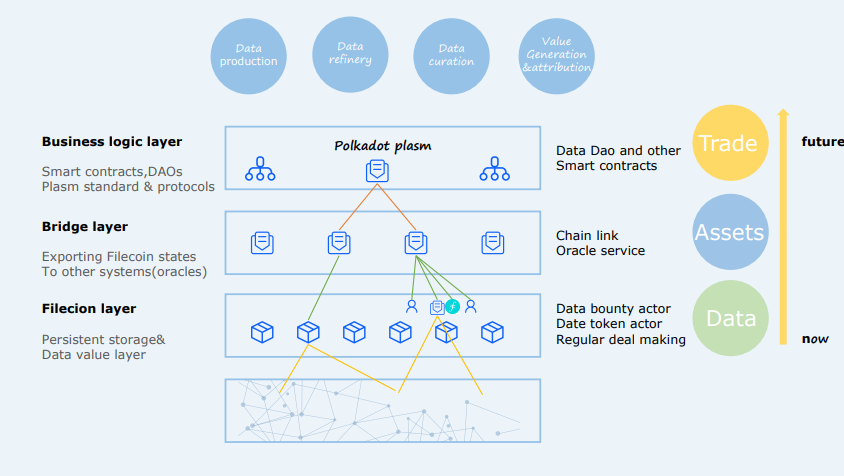
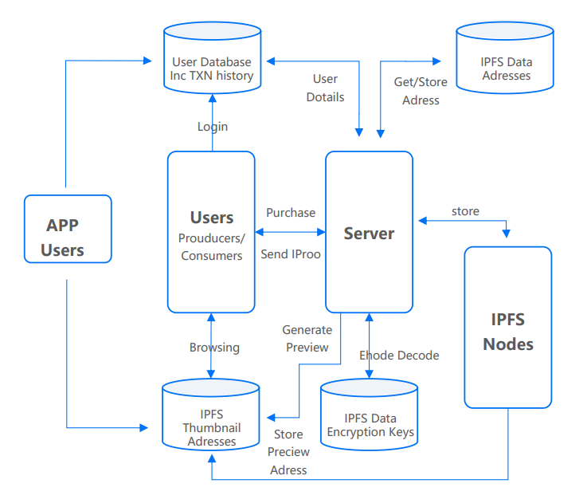
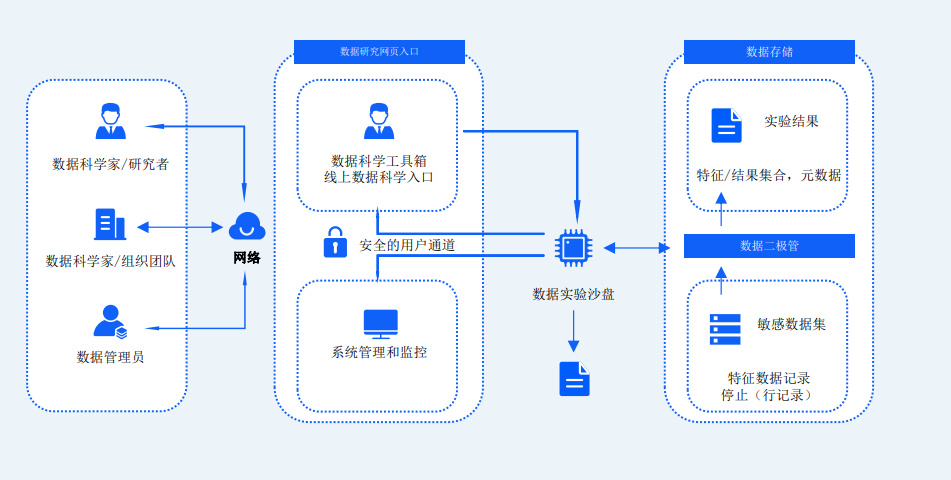

## 技术架构图

Sinso 在技术架构中，IPFS 作为整个项目基础的存储系统，Filecoin 作为我们高价值
数据的持久层存储。对于医疗数据是否高价值取决于用户选择，我们可以理解 IPFS 更
多倾向于热数据，在诊疗过程完毕后形成的高价值数据向 filcoin 中进行归档。我们通
过预言机建立和真实外部数据的桥接，这个过程是由 Sinso Gateway 来完成，这部分
还会持续加强数据治理功能，包括数据标签和分类及隐私计算的前置处理。最上层是
基于 Polkadot 的平行链 Plasm 来实现，Plasm 是们目前唯一支持 Layer2 扩容的多虚
拟机可互操作智能合约平台。Plasm 已经可以部署 Solidity 合约（当然也支持 WASM
的 Ink！），所以我们在商业逻辑层将会有强大的灵活性。包括支持 NFT 的 ERC720 和
ERC721 都完全没有问题。

Plasm 不需要在独立的 Substrate 链上面部署合约（开发一个平行链所需要的的经济
成本巨大），这样的选择大大提升了部署效率，并且降低了门槛和 gas 消耗。除了兼
容以太坊，我们将会采用丰富的组件包括 Optimistic Rollups、ZK Rollups 和 Plasm 一齐构建 Layer2 综合解决方案。我们的技术选型兼容性更佳、交易成本低、速度更快、
技术难度更小。

特别提到的是，WASM 不仅可以运行在浏览器上，也可以运行在非 web 环境下,和目
前基于 HTML5 的医疗数据展现有极强的耦合性，无论是在 Donors Network 还是
gateway 可以方便松耦合集成。

借助于 Plasm 的生态，我们还可以收到一部分智能合约的部署奖励，我们会把合约的
部署做成开发的平台，激励外部团队扩展 Sinso 的架构。可以构建一个有激励模式的
开发生态！我们将会率先在波卡的先行网络 Kusama 中发布应用！

## 病历数据 IPFS 分布式存储

**医疗数据存储：**

存储数据审核通过后进行分片生成分片地址，将分片地址储存于 IPFS Data Adresses
数据库中，分片数据存储在 IPFS 节点服务器上。合约浏览：用户通过请求授权之后获
得 IPFS Data Encryption key（IPFS 数据加密密钥），然后从 IPFS Data Adresses 获
得文件地址，继而从 IPFS 节点服务器中取得数据，在 WEB 端展现处理，根据组合规则进
行合成为最终的展现数据。

**预言机：**

我们尽量使用和 filcoin 高度集成的 Chainlink 解决方案（去中心化预言机），以实现
Filecoin 网络与以太坊、Plasm 等支持智能合约的区块链之间的双向连接。经过安全
审查的、抗女巫攻击（sybil）的节点操作器（node operators），这些节点操作器
可以很容易地组成去中心化的预言机网络，以保证围绕预言机服务的强大的运行时间
和抗篡改能力。

## 智能合约管理

在区块链技术体系下，存储的医疗信息核心信息或者大部分数据上链，数据的使用和
改变会被记录，因此数据存储机构不再能够在用户不知情的情况下随意使用用户数据，
实现了存储和使用的权限离。个体身份认证信息的分布式存储，避免了中心化存储被
篡改、被盗用的的风险。再通过区块链的多私钥的复杂权限保管，将数据使用权回归
个体。数据的使用需通过用户授权而实现个体医疗信息的隐私保护。例如通过智能合
约技术可以设置单个病历分配多把私钥 , 并且制定一定的规则来对数据进行访问 , 无论是医生、护士或者病人本身都需要获得许可才能够进行。通过 IPFS 网络和
Filecoin 将核心关键数据记录存储在区块链上，通过智能合约来对数据进行方案控制，
利用预言机网络和外部链的和合约进行交互。这样就能实现医疗费用和对应的医疗数
据还有保险合同都是自动验证的，可以顺利实现“全自动化”的医疗保险支付场景。

