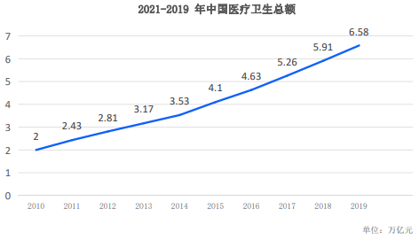

# 背景分析

## 各国庞大的医疗费用

无论是美国还是中国，医疗费用都在急剧上升。

下图是中国近十年来医疗费用的支出情况：

美国从 1975 年医疗人均消费 550 美元到现在已经达到 11000 美元/年，美国学者预测
到 2037 年，平均医疗支出将会超过家庭收入的中位数。尽管医疗科技的发展正在进
行，高新技术不断涌现，但是很多人无法承受个人的医疗花费。最近来看中国个人承
担的医疗支出比例已经到达 50%以上，很多医保资金薄弱地区，个人承担部分已经
达到 70%。

在美国医疗保险贫富差距明显，相比于中产阶级和富人，低收入的美国人接受医疗服
务的机会普遍少于前者。疫情更加加剧了贫富差距，根据美国保险行业组织研究，新
冠肺炎住院患者的花费中位数为 3 万美元至 6 万美元不等（约 20 万至 40 万元人民币），
对于数千万医疗保险不足或没有保险的人来说，这意味着随时处于破产边缘。在中国
这种医疗差距并没有那么大，政府的干预保障了医疗服务的活动率，但是医保资金的
支付压力还是很大，个人自付比例还在逐年增加。在非洲不发达地区，不仅医疗资源
匮乏，医疗资源分布不均衡，巨大的贫富差距更谈不上医疗保健的平等。

## 急剧增大的医疗数据

我们在医疗过程中产生数据，按照中国的法律和相关规定，医疗机构要强制性帮助患
者代托管 30 年，门诊数据是 15 年，而且中国还未解决碎片化和数据孤岛问题，在美国
也一样。我们知道，医疗健康和诊疗和我们的健康数据和病历密切相关，如果能够合
理应用数据可以极大提升我们的的健康水平，并且降低我们的医疗总体支出。因为没
有从数据变成数据资产这一转化动作，我们无法持续对数据进行“深度表型分析”，
我们对于自己的健康认知始终是碎片化和肤浅的状态。我们时常关注医疗机构产生的
数据，我们觉得似乎那就是我们的全部，但是在个体分析中，这些数据远远不够，我
们需要拥有集深度、长度、广度为一体的数据。我们必须要开辟一个新的土壤，一个
能够做“深度表型分析”的土壤。“消费者不仅仅是数据生产者，更应该拥有自己的
数据，并且获得更多的医疗数据，最终对自己的健康负责”。顺便补充一下，按照目
前医疗行业的发展趋势个人医疗数据从几百 MB，到几百 TB 的趋势在发展，可能未来会
到 PB 级，机构（医疗机构和国家的相关卫生机构）几乎难以完成医疗数据的全面托管，
这不仅是一笔非常庞大的开支，并且目前的体制也很难对托管单位进行激励。

## 区块链技术解决医疗信任的鸿沟

这些年我们可以看到医疗技术发生了非常大的进步，即使中国非常偏远的乡村都比较
容易拥有一台相对比较先进的 DR 或者 MR（磁共振），通过远程影像诊断平台，可以进
一步解决优质医生资源分布不均的问题。但是我们会发现我们和医生沟通的时间一直
在下降。美国从 1975 年首诊 60 分钟降低到现在的 12 分钟，医疗技术的发展并没有使得
医生和患者直接建立紧密的信任。并且，医患沟通的缺失与医疗误诊信息息息相关，
和患者肤浅的接触将会导致更多的误诊，从而增加非必要的检查和无效的治疗。医疗
行业的从业者往往会重视数量，我们要完成巨大的经济回报，其实这是一个怪圈，大
约有 30%~50%的 CT 扫描是不必要的。我们需要迎来新的理念——“少就是多”，我们
希望是有效并且是精确的，而不是大量的浪费。我们期待 Sinso 有这样项目的潜在有
能力去修正之前已经没有办法撼动的基础。医生会出现认知偏差、医院会夸大诊断和
治疗的益处，但是我们需要反省，医疗产业是越庞大越好吗？我们既没有办法监督也
没有办法激励和惩罚，Sinso 的使命是建立一个让人类的“更健康、更美好”的时代，
我们的愿景是“让人类进入民主医疗时代”，我们需要建立一个公平、透明的以个人
为拥有数据为前提的医疗健康基础设施。机器和人工智能的兴起应该伴随更好的人性
化，让医生有更多时间陪伴患者、感同身受、这才是真正地实现优质的医疗。

区块链技术最大的价值是解决信任的问题，很多结合中心化数据库和密码学的技术被
搬到医疗领域，这些往往不是区块链核心要解决的问题，导致一般人很难分辨区块链
医疗的核心本质和解决问题的第一性原理。 Sinso 核心在于解决的还是构建一个新的
医疗信任的土壤。“个人健康的数据管理革命”就是第一步。
