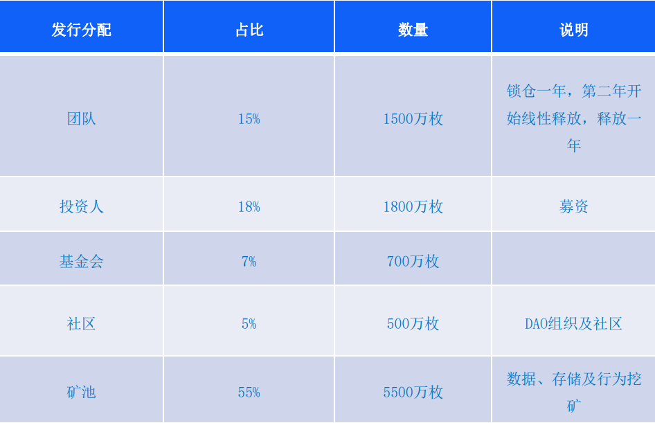
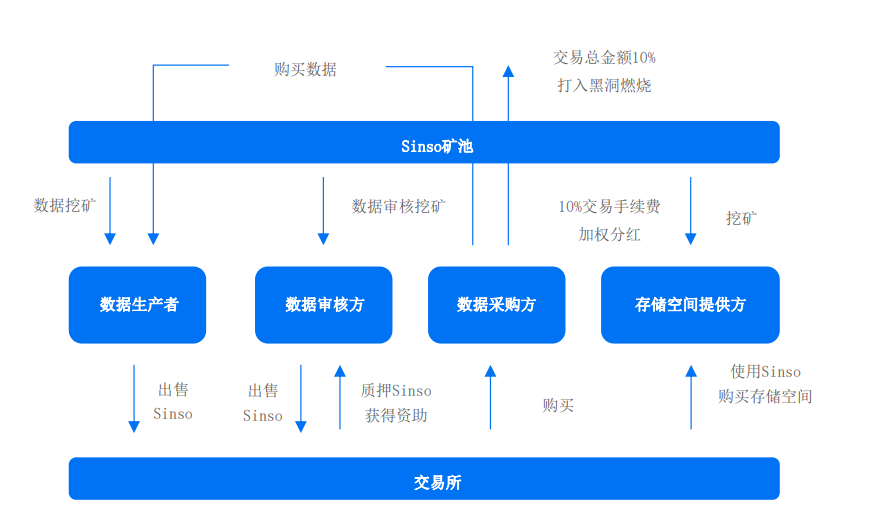

## Sinso 发行细则

TOKEN 名称：Sinso

总量：1 个亿 永不增发

TOKEN 类型：基于 Polkadot 的平行链 Plasm 发行

## Sinso 通缩机制

- 数据生产者 通过数据上传、分享、加工等可以进行挖矿获得 Sinso；
- 数据审核方 通过在交易所购买 Sinso 后质押足够量的 Sinso TOKEN ，即可获得审
  核节点的资格，进而通过数据有效性审核来进行挖矿获得 Sinso；
- 数据采购方 健康数据需求方需支付 Sinso TOKEN 在数据交易市场和数据生产者或
  数据共享池购买数据，凡交易过程需要燃烧 10%的交易手续费，10%给存储空间
  提供者进行加权分红；
- 数据存储空间提供方，购买存储空间需要燃烧指定数量的 Sinso，数据将会不断消
  耗储存空间，存储空间提供者可通过数据存储和交易分红进行挖矿，从而获得丰厚
  的 Sinso 奖励。
- 除此之外，在开放式的智能合约框架中，结合智能合约部署还有奖励机制。
